<p align="center">
  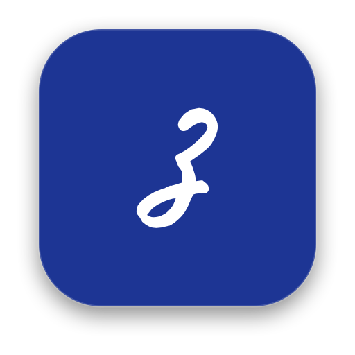
</p>

<h1 align="center">Заметочки</h1>

<p align="center">
  Простые и красивые заметки для Mac.<br>
  Пишешь от руки - а получается аккуратно.
</p>

<p align="center">
  <a href="https://github.com/romankandeevy/zametochki/releases/latest"><b>Скачать для macOS</b></a> ·
  <a href="#что-умеют">Что умеют</a> ·
  <a href="#как-собрать">Собрать самому</a>
</p>

<p align="center">
  <a href="https://romankandeevy.github.io/zametochki/">
    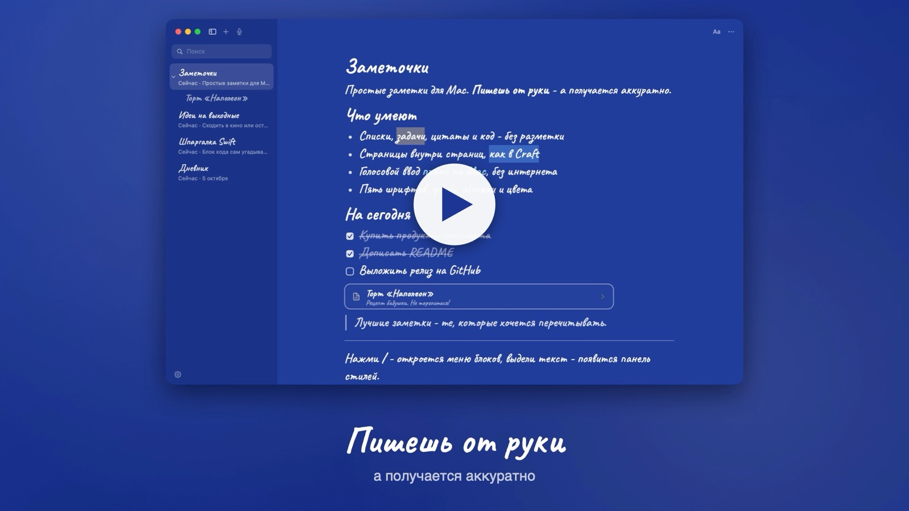
  </a>
  <br>
  <sub>Нажми, чтобы посмотреть ролик (40 секунд) · <a href="https://romankandeevy.github.io/zametochki/">сайт проекта</a></sub>
</p>

Синий фон, почерк [Caveat](https://fonts.google.com/specimen/Caveat), мягкий звук печати и ничего лишнего. Внутри - блоки как в Notion и страницы как в Craft, но без разметки, аккаунтов и облаков: всё хранится только на твоём Mac.

Ролик в 1080p и 60 кадров в секунду - в [последнем релизе](https://github.com/romankandeevy/zametochki/releases/latest).

## Что умеют

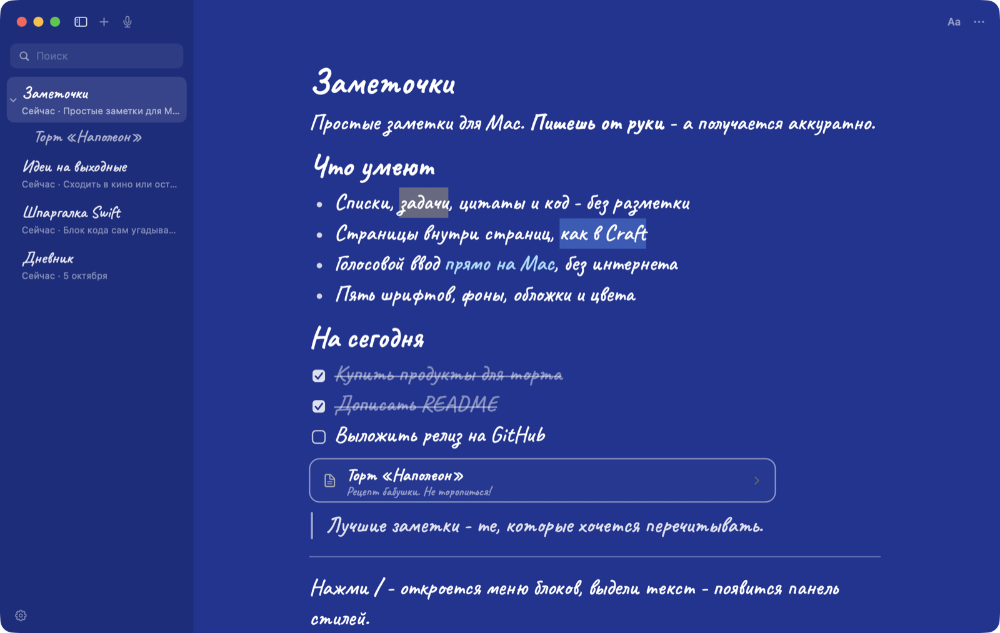

**Заголовок всегда наверху.** Первая строка заметки - её заголовок: крупный, отделён от текста тонкой линией, и тип у него не меняется. Всё, что ниже, - текст и блоки.

**Текст без разметки.** Звёздочек и решёток не видно: пишешь `#` - строка становится заголовком, `-` - списком, `[]` - задачей. Заглавные буквы ставятся сами.

**Панель над выделением.** Выдели слова - появится панель: жирный, курсив, подчёркивание, зачёркивание, маркер восьми цветов и цвет текста.

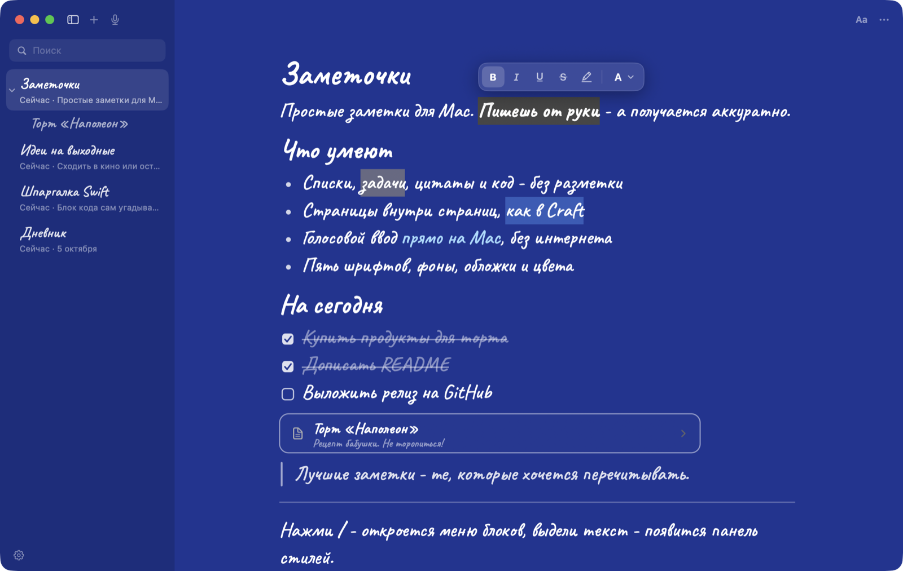

**Меню «/» и «+».** Нажми `/` в начале строки (или `+` слева от неё) - меню блоков с поиском: `/код`, `/h1`, `/табл`.

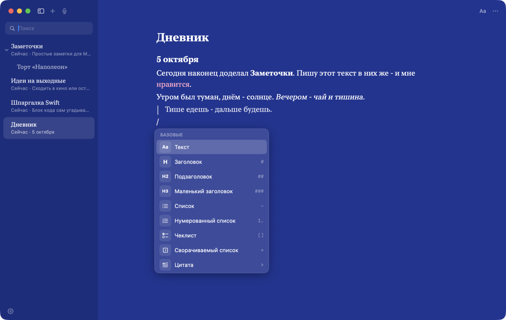

**Блоки:** заголовки трёх размеров, списки, нумерация, чеклисты, сворачиваемые списки, цитаты, код, разделители, картинки, файлы, таблицы, белые доски для рисования, канбан-доски, голосовые заметки. Любую строку можно утащить за ручку ⠿ в другое место.

**Код с подсветкой.** Тёмная рамка, язык угадывается сам (или выбирается вручную из 17), подсветка синтаксиса и кнопка «Скопировать».

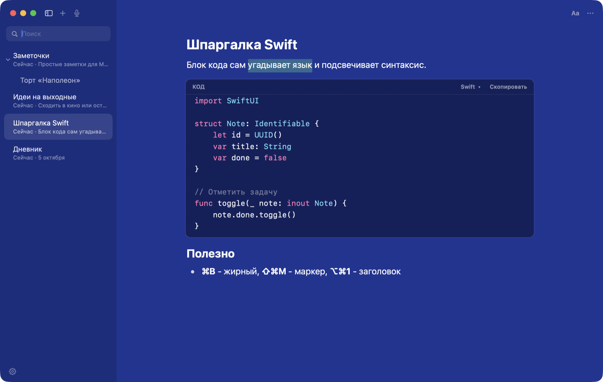

**Страницы внутри страниц.** Как в Craft: карточка страницы прямо в тексте, дерево слева, крошки сверху. Заметки перетаскиваются мышью.

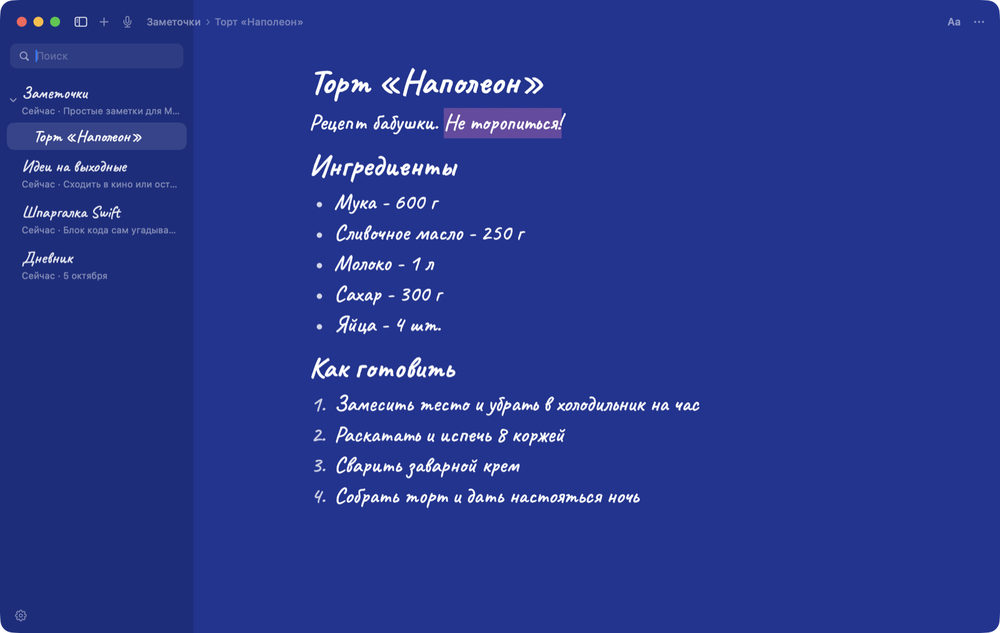

**Свой стиль у каждой страницы.** Пять шрифтов, 14 цветов фона, градиенты, своя картинка, обложка, цвет текста, вид разделителей и карточек. Любой стиль можно сделать стилем по умолчанию - под него подстроится даже иконка в Dock.

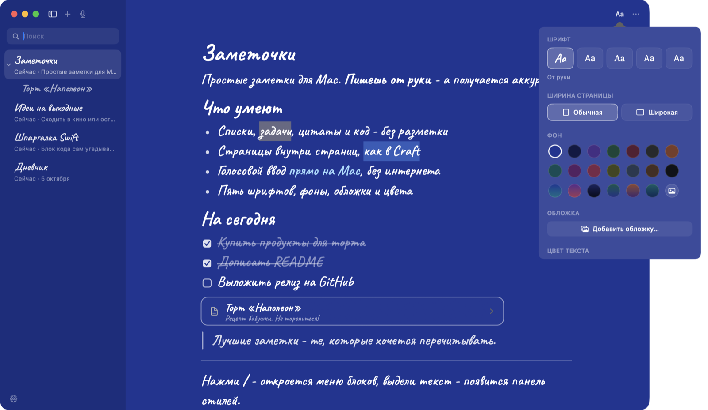

**Три вида интерфейса.** Тихий - список слева и всё. Craft - дерево и панель блоков справа. Тетрадь - текст по центру и плавающая полоска снизу.

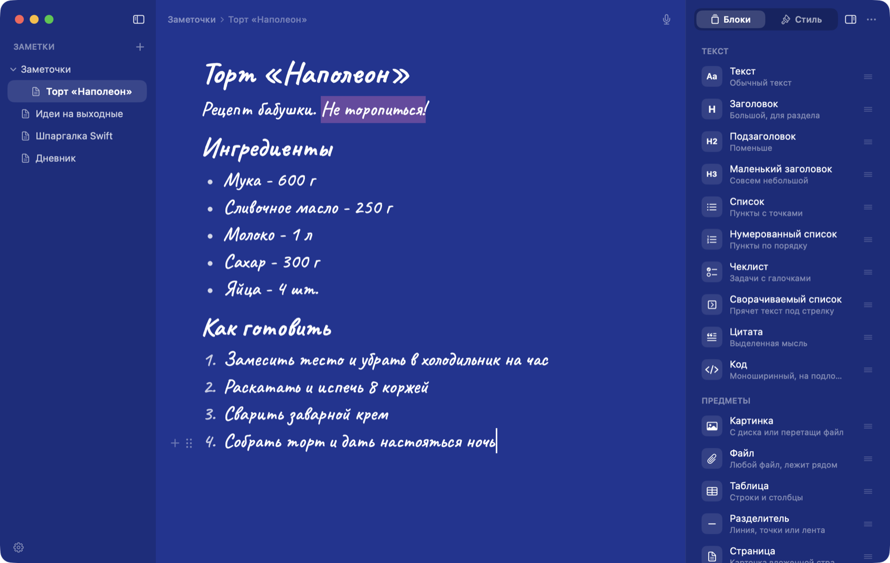
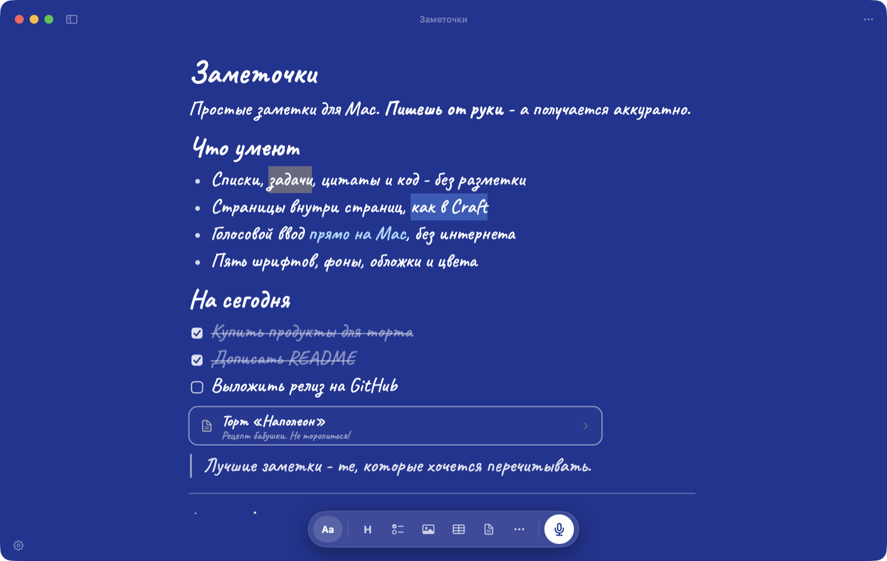

**Голосовой ввод.** ⇧⌘D - говоришь, слова сразу появляются в тексте, в конце расставляются знаки препинания. Распознавание работает локально через движок [FlowLocal](#голосовой-ввод), без интернета.

**Белая доска.** `/доска` - бесконечный холст в своём окне: карандаш и маркер, ластик, линии и стрелки, которые держатся за фигуры, прямоугольники, овалы и ромбы, стикеры, надписи и картинки. В заметке доска видна превью, нажми - откроется для рисования. У доски своя отмена ⌘Z.

**Канбан-доска.** `/канбан` или ⌥⌘K - колонки и карточки прямо в заметке. Карточки перетаскиваются между колонками.

**Голосовые заметки.** ⌥⇧⌘D или `/голос` - запись встаёт в текст плеером с волной, а под ней расшифровка. Без FlowLocal запись сохраняется без текста.

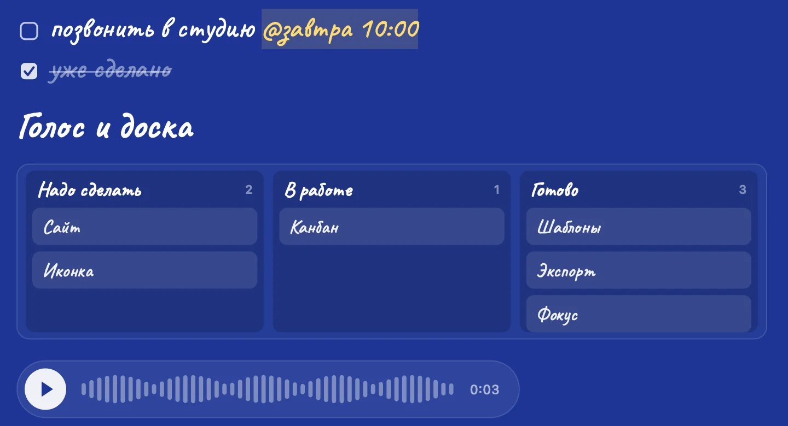

**Напоминания.** Допиши к задаче `@завтра 10:00`, `@18:30`, `@пт` или `@15.10 9:00` - в это время придёт уведомление macOS. Отметил задачу - напоминание снимается.

**Шаблоны.** `/шаблон` или «Файл → Новая из шаблона»: встреча, план недели, идея проекта, дневник, покупки, проект с доской.

**PDF и картинка.** «⋯ → Экспорт» сохраняет страницу в PDF или PNG такой, какой её видно: фон, почерк, галочки, доска. «Скопировать как картинку» - сразу в буфер, чтобы вставить в мессенджер.

**Фокус и счётчик слов.** В правом нижнем углу - слова и время чтения (с выделением - сколько слов выделено). Нажми на плашку или ⇧⌘F - режим фокуса приглушит всё, кроме строки, которую пишешь.

**Быстрая заметка.** ⌃⌥N из любой программы: окошко поверх всего, Enter - и мысль уже в заметке «Входящие». `[] ` в начале - задача, `@завтра 10:00` - с напоминанием.

**Т9 и прочее.** Исправление опечаток и подсказка конца слова, размер текста, звук печати, проверка орфографии, окно поверх всех, экспорт всех заметок в Markdown.

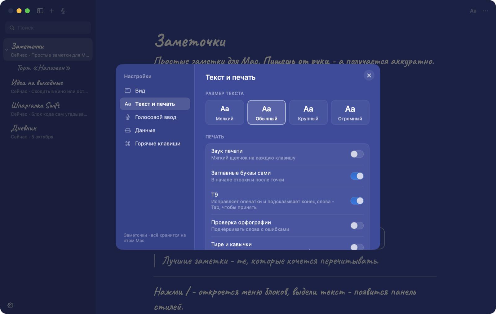

## На iPhone

[romankandeevy.github.io/zametochki/app](https://romankandeevy.github.io/zametochki/app/) - те же Заметочки в Safari: открой ссылку, «Поделиться» → «На экран „Домой“», и они встанут как приложение и будут работать без интернета. Заголовок наверху, блоки, меню «/», канбан, голосовые заметки, шаблоны, напоминания, стили страниц. Белая доска для рисования пока только на Mac. Заметки хранятся только на телефоне; с Маком они ходят файлами: Markdown туда и обратно, а заметки `.json` из папки Zametki открываются на iPhone как есть.

## Данные

- Заметки - обычные JSON-файлы в `~/Library/Application Support/Zametki`.
- Картинки и файлы - рядом, в папке `Assets`.
- Если заметка вдруг сильно уменьшилась, её прошлая версия сохраняется в `Backups`. Сохранение - сразу, на каждое изменение.
- Импорт и экспорт: Markdown, текст, RTF. «Сохранить все заметки в Markdown» - папками, как в дереве.

Ничего не уходит в сеть.

## Установка

1. Скачай `Zametochki-1.0.zip` из [релизов](https://github.com/romankandeevy/zametochki/releases/latest) и распакуй.
2. Перетащи **Заметочки** в «Программы».
3. Приложение не нотаризовано Apple, поэтому при первом запуске: правый клик → **Открыть** → **Открыть**.
   Или в Терминале: `xattr -dr com.apple.quarantine /Applications/Zametki.app`

Нужна macOS 14 Sonoma или новее.

## Как собрать

Нужны только Command Line Tools (`xcode-select --install`), Xcode не обязателен.

```bash
git clone https://github.com/romankandeevy/zametochki.git
cd zametochki
./build.sh run       # собрать и запустить
./build.sh install   # положить в ~/Applications
```

## Голосовой ввод

Распознавание речи берётся из [FlowLocal](https://github.com/romankandeevy/flowlocal) - локального движка на моделях GigaAM. Если FlowLocal установлен, кнопка микрофона работает сама; если нет - в настройках будет видно, чего не хватает. Всё остальное работает и без него.

## Горячие клавиши

| | |
|---|---|
| ⌘N | Новая заметка |
| `/` | Меню блоков |
| ⌘B · ⌘I · ⌘U | Жирный, курсив, подчёркнутый |
| ⇧⌘X · ⇧⌘M | Зачёркнутый, маркер |
| ⌥⌘1 · 2 · 3 | Заголовки |
| ⇧⌘7 · ⇧⌘9 · ⇧⌘L | Список, нумерованный, чеклист |
| ⌥⌘P | Страница внутри |
| ⇧⌘D | Голосовой ввод |
| ⌥⇧⌘D | Голосовая заметка |
| ⌃⌥N | Быстрая заметка из любой программы |
| ⌥⌘K | Канбан-доска |
| `/доска` | Белая доска |
| ⇧⌘F | Режим фокуса |
| ⌘\ | Список заметок |
| ⌥⌘↑ · ⌥⌘↓ | Предыдущая и следующая заметка |
| ⌘, | Настройки |

## Как устроено

SwiftUI для окна и панелей, AppKit (`NSTextView`, TextKit 1) для редактора. Оформление хранится смысловыми атрибутами (жирный, тип строки, цвет), а внешний вид каждый раз считается из стиля страницы - поэтому смена шрифта или фона перерисовывает всё сразу и разметка нигде не видна. Предметы (карточки, картинки, таблицы) - вложения `NSTextAttachment` со своей отрисовкой.

```
Sources/Zametki/
  Editor.swift        редактор: блоки, меню «/» и «+», перетаскивание, код
  Formatting.swift    модель документа и превращение смысла в внешний вид
  Store.swift         заметки на диске, дерево страниц, резервные копии
  PageStyle.swift     стиль страницы: шрифты, фоны, цвета
  CodeHighlight.swift подсветка синтаксиса
  Layouts.swift       три вида интерфейса
  Inspector.swift     панель «Блоки | Стиль»
  SettingsView.swift  настройки
  Dictation.swift     голосовой ввод через FlowLocal
  Audio.swift         голосовые заметки: запись, волна, проигрыватель
  Board.swift         канбан-доска: блок в тексте и окно правки
  Whiteboard.swift    белая доска: предметы, превью в тексте
  BoardCanvas.swift   холст белой доски: рисование, фигуры, стрелки, отмена
  BoardWindow.swift   окно белой доски с инструментами
  Reminders.swift     «@завтра 10:00» в задачах и уведомления macOS
  Templates.swift     шаблоны страниц
  PageExport.swift    страница в PDF и PNG
  QuickNote.swift     быстрая заметка по ⌃⌥N
  Stats.swift         счётчик слов и время чтения
```

Тесты (разбор дат в напоминаниях, доски, заголовок, шаблоны, «Входящие», запись звука, экспорт страницы): `swift test`.

## Лицензия

[MIT](LICENSE). Шрифт Caveat - [SIL Open Font License](Resources/OFL.txt).
